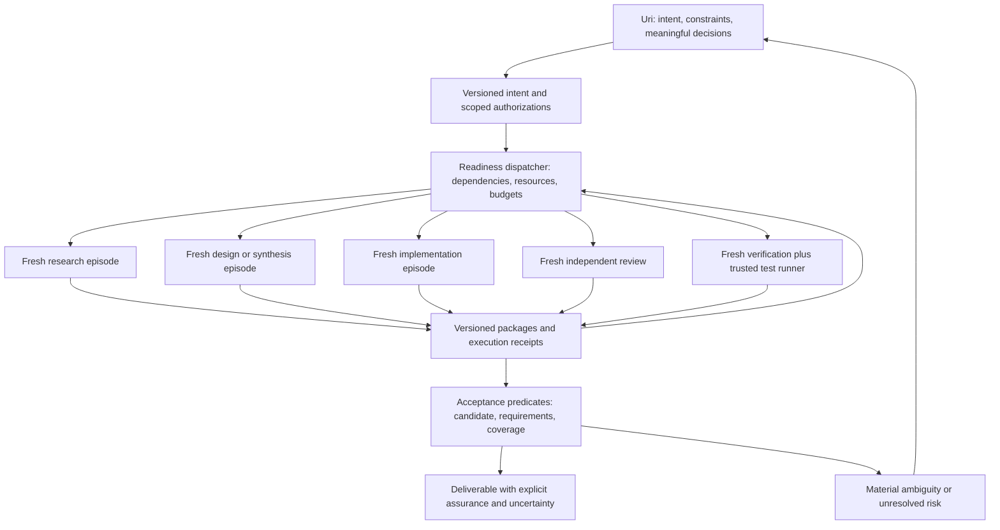

# What should survive AILedger 2.0?

> **Roadmap update, 2026-09-28:** this investigation remains the original architectural evidence and
> hypothesis. The [respecified backlog](../Backlog/structured-agent-interface.md) now prioritizes
> installable structured-interface increments and feedback from Uri's real tasks. Its current task
> numbers supersede the original 7–8 experiment shorthand below; the analysis is preserved unchanged.

Architectural investigation, 2026-09-28. No kernel commands were invoked. No implementation changes were made.

## 1. Executive finding

**Preserve durable evidence, versioned handoffs, explicit authority, and independent assurance. Replace the mandatory task-wide workflow with bounded episodes connected by artifact dependencies. Test this as a sidecar before committing to a replacement.**

The durable value demonstrated by this sample is primarily a combination of epistemic recording, provenance, quality assurance, and selective context preservation. Some coordination is indispensable, but the evidence does not establish that a long-lived coordinating LLM or an eleven-stage task machine is the best way to supply it.

The most important qualification is that AILedger already executes many short, fresh agents. Of 220 available provider result files in the sample, 187 report a fresh launch and 33 a resume. Across 235 recorded run endings, the median recorded run duration is 4.21 minutes. The proposed improvement cannot be described simply as replacing one long agent with several short ones. It must also replace accumulated task briefs, unnecessary filing episodes, and manual orchestration with bounded, relevant input and reliable mechanical services.

**A fresh session receiving the accumulated task narrative is not a bounded episode.** Current context construction narrows claims and evidence for work items, but still carries all active constraints and all alternatives. Task-wide planning runs receive much broader state. Ten sampled launches failed because required context exceeded the default 262,144-byte ceiling. The rejected launches themselves consumed about two recorded seconds in total; their significance is failed admission and subsequent recovery, not ten long computations wasted. [S1][S2][S12][H1]

The data supports a smaller system, but does not establish a causal law that agents inevitably reason worse with elapsed time or larger contexts. There is no controlled comparison here that separates context size, difficulty, model, tools, changing requirements, and repair history. Context failures, repeated ceremony, missed facts, and repair regressions are observed. The proposed cognitive benefit remains a hypothesis to test.

### Evidence base and limits

The primary sample is nine tasks opened September 23–27, with ledger events frozen through 2026-09-28 07:22:05 UTC: 3,577 events, 235 recorded runs, 101 journalled refusals, and 220 available provider transcripts. It includes ongoing and completed work. I inspected source at repository HEAD b72437a and additional historical records from September 10 and September 20–22. Existing working-tree changes were left alone.

Provider counts below use distinct failed tool results within each available transcript. They count 549 explicit Claude permission denials and 275 C# search-hook refusals. They are observations about available Claude transcripts, not provider-neutral rates or a claim that every refusal was unnecessary. Two successful reads containing quoted denial text were excluded. Kernel refusals and provider failures are different observation boundaries; do not divide or sum them into a universal error rate.

| Sampled task | Ledger events | Recorded runs | Kernel refusals | Claude permission denials | Search-hook refusals |
|---|---:|---:|---:|---:|---:|
| Armis blank name/sites | 69 | 3 | 0 | 3 | 7 |
| S3 storage design | 384 | 20 | 1 | 50 | 44 |
| YAML infrastructure assessment | 750 | 60 | 21 | 130 | 79 |
| Falcon alignment | 278 | 13 | 4 | 39 | 26 |
| Purposeful lesson refresh | 463 | 37 | 6 | 98 | 46 |
| Axonius parser follow-up | 97 | 6 | 4 | 6 | 6 |
| Coordinator operating manual | 206 | 16 | 4 | 17 | 7 |
| Container verification | 408 | 24 | 12 | 76 | 41 |
| Axonius bundle | 922 | 56 | 49 | 130 | 19 |
| **Total** | **3,577** | **235** | **101** | **549** | **275** |

Of 196 run endings with usable first-write timing, the median first ledger write occurred 61.4% into recorded run duration; 137 first wrote after halfway. This suggests a preservation weakness, but does not prove the interface caused delayed writing. Duration and provider-token fields have their own coverage; task wall time includes pauses and external waits. Retrospective prose sometimes predates the final events and is treated as testimony to check, not authoritative current totals.

### Findings that drive the recommendation

1. **A useful guardrail can be cheap.** Falcon alignment refused evidence LE8 for claim C1, named the correct relationship, and the operator resolved C1 using LE13 3.9 seconds later. Preserve referential and directional integrity. This corrected an evidence link; it does not prove the rule discovered a false substantive conclusion. [H2]
2. **A capability restriction can manufacture an entire episode.** Infrastructure run RO3 spent 98.5 seconds transcribing ten existing alternatives that workers lacked authority to record. It made no new design decision. Its first helper command was denied; its final report says it removed backticks to avoid shell interpretation. Preserve authorization for acceptance, not a privileged monopoly on recording observations. [H3]
3. **Transport rules can degrade the surviving account.** S3 run RE3 had evidence EIE6 rejected three times by the C# search hook. The command was recording evidence. The accepted wording omitted the explicit Roslyn-query account present in earlier attempts. Typed recording should treat evidence prose as data. [H4]
4. **Granular events need not create granular interactions.** Falcon RN1 already had 20 claims and 20 evidence records prepared. Three denied attempts were followed by 11 consecutive successful filing calls, without intervening investigation. The first denial to the final write spanned about 3m18s. Successful calls already grouped literal commands; batching exists informally but is unreliable. [H5]
5. **Persistent knowledge changes later work.** Axonius follow-up instructions explicitly preserved the earlier decision not to deduplicate CVE rows because Exposure Analytics performs the merge. Infrastructure claim KC5 derived from a prior lesson about the shipping branch. Deleting durable cross-episode knowledge would lose demonstrated value. [H6][H7]
6. **Assurance adds value beyond recording.** The Axonius and infrastructure records identify defects found by reviewers after verifiers, including pagination/data-loss and policy behavior defects. However, that establishes the value of independent inspection, not every required stage transition around it. The underlying claim records include GC1/GC2, PGC1, VC1 and RCRC1, rather than only retrospective assertions. [H8][H9][H14][H15]
7. **Governance does not make a false belief true.** A September 10 investigation concluded BaseRef was absent after its brief prohibited source reads. That false finding reached lessons before correction. More mandatory recording did not fix a defective evidence boundary. [H10]

## 2. Survival map

The categories below identify the primary responsibility: A epistemic integrity; B provenance; C authorization; D handoff; E assurance; F orchestration; G learning/measurement. KEEP means keep the property and useful implementation, not preserve every dependency of its current class. DELETE refers to the new execution path; historical event readers must remain compatible.

| Mechanism | Responsibility | Disposition | Evidence, cheaper form, and required state |
|---|---|---|---|
| Human objective and acceptance boundaries | C/D | KEEP | Axonius convention mistakes show why intended behavior matters. One versioned intent record, not repeated prose in every constraint. Cross-episode. |
| Actor/provider/session/model identity | B | KEEP | Run files distinguish fresh, resumed, failed, and real provider work. Bind identity to the launch, not an agent-supplied string. Episode-local identity, durable receipt. |
| Seven role names and role-default capability bundles | C/F | SIMPLIFY | RO3 is direct evidence of a recording restriction without added judgment. Use narrow action grants and input profiles; roles remain useful descriptions. |
| Claims and assumptions | A | SIMPLIFY | C1/LE13 and the BaseRef error justify explicit epistemic status, not a global claim for every sentence. Local finding IDs; promote consequential dependencies. |
| Evidence links, supports/refutes relationships | A/B | KEEP | Four direction refusals occur in the sample. Check link existence and declared direction; do not call that proof of truth. Globally addressable, locally selected. |
| Source snapshots and runtime receipts | A/B/E | KEEP | Candidate hashing and actual host-side test results mattered in Axonius. Store commit/content/environment identity and immutable outputs. |
| Global claim resolution for all findings | A/F | DECOMPOSE | Infrastructure had 168 open claims, 164 with some supporting evidence. Separate observation recording, local conclusions, and authoritative acceptance of consequential premises. |
| Dependency invalidation | A/D/E | KEEP | PGC21 correction invalidated D11 and W4; KC4 correction affected infrastructure work. Apply to artifact consumers and assurance, not one global stage. |
| Correction versus refinement | A/D | SIMPLIFY | Timing of replacement validation can turn a correction into irreversible work churn. Preserve both versions and require explicit impact assessment for consumers. |
| Decisions and their authority/rationale | C/D | KEEP | Dedup and release choices must not be silently rediscovered. Store decision scope and assumptions once; human handles consequential choices. |
| Constraints | C/D | SIMPLIFY | All active constraints currently flow into ordinary briefs. Separate actual invariants from dispatch instructions; select by resource and dependency. |
| Rejected alternatives | A/D | SIMPLIFY | Workers should record them directly. Carry only options likely to be repeated or necessary to understand a tradeoff; archive the rest. |
| Challenges/disagreements | A/C | DECOMPOSE | A dedicated challenge lifecycle is not demonstrated as necessary by this recent sample. Keep contradictory evidence and a contested finding; optional issue workflow can own resolution. |
| Escalations | C/F | SIMPLIFY | Preserve material business questions and attempted discovery. Replace operator-only closure of every incidental question with scoped authority and typed blockers. |
| Immutable artifacts, content identity, revision lineage | B/D/E | KEEP | Current candidate and supersession checks protect what was actually reviewed. Packages become the durable handoff unit. |
| Artifact authorship and provenance | B/C | KEEP | A report must name its actual producer. An observer can submit a report without authority to approve its subject. |
| Governing artifact filing restricted to active lead runs | C/F | DECOMPOSE | RP2 existed to file already-drafted contract/plan artifacts. Receipt submission should not require a second cognition episode; endorsement remains separate. |
| Markdown table shapes as an enforcement API | A/F | DELETE | Artifact vocabulary/filing refusals are visible across tasks. Validate typed content and render Markdown; do not make prose formatting the authoritative transport. |
| Work-item scope occupancy | C/F | EXTERNALIZE | Parallel execution still needs isolation. Use resource leases/worktrees in the execution host, with separate read and write grants. Do not delete concurrency protection. |
| Work-item verification/freshness | E | DECOMPOSE | Bind assurance to candidate content and requirements. Keep coverage; delete the need to manufacture a working run for unchanged code. |
| Frozen candidate and multi-member assurance binding | B/E | KEEP | Current source already supports exact candidate/work membership and matched outputs. Generalize its useful identity property to packages. [S3] |
| Independent verification | E | KEEP | Actual test evidence and distinct review findings justify it. Choose scope and independence requirements according to risk. |
| Mandatory cross-provider verification in every case | E/F | SIMPLIFY | The corpus demonstrates complementary findings, not causal superiority of every provider pairing. Record provider/session/method independence; explicit degraded assurance when unavailable. |
| Blind technical code review | E/D | KEEP | Earlier contamination is recorded; the newer bound-review path already omits state narrative. Preserve this capability, not the legacy leak. [S1][S4] |
| Strict verifier-before-review sequence | E/F | EXTERNALIZE | Same immutable candidate permits parallel independent passes. Sequence only when a report genuinely depends on the preceding output; never call parallel reports a paired sequential review. |
| Automatic test execution, environment/provenance capture | B/E | KEEP | Host-side Spark/container execution closed sandbox gaps. Make this a trusted runner service rather than operator transcription. |
| Launcher-owned run closure | B/E | KEEP | An agent must not certify its own observed process ending. Separate process outcome, submitted result, and assurance verdict. [S5] |
| Recovery after failed/cancelled runs | B/D | KEEP, strengthen | RW7 left claims/evidence despite cancellation; a later run duplicated work. Emit durable partial receipts and a change manifest at termination. [H11] |
| Append-only record, locking, replay compatibility | B | KEEP | These enabled this investigation and preserve corrections. Storage cannot prove semantic honesty. Retain crash-safe batch boundaries without replaying the whole task into every brief. [S6] |
| Broad task context projection | D/F | DELETE | All-task planning context produced repeated size failures. Replace with positive selection of package dependencies and relevant counterevidence. |
| Context budget and delivered-input identity | B/D | KEEP | Fail closed on silent omission of essential input, but split the episode or reference sources before launch. Record exactly what was supplied. |
| Skill-hash freshness refusal | D/F | SIMPLIFY | Six sampled brief availability/freshness refusals. Pin procedure versions at launch; new guidance affects new episodes, with explicit handling of critical revocations. |
| Internal recon bound to the entire claim-set hash | A/D/F | DECOMPOSE | A claim addition forced a refresh episode. Keep research coverage and uncertainty; invalidate only affected package dependencies. |
| Eleven-stage machine and transition graph | F | DELETE | Twenty-nine sampled refusals concern stage/prerequisite rules. Artifact admission can enforce useful prerequisites without a global phase coordinate. [S7] |
| Entry-action stage gates | F | DELETE | Recording lessons or starting a useful research episode should not require walking a task through enum positions. |
| Task-wide prerequisite machinery | E/F | DECOMPOSE | Preserve conditions such as required evidence or current assurance as package-use predicates. Delete sequencing conditions that merely establish phase history. |
| Long-lived coordinating LLM | F | DELETE | It carries growing narrative and performs repetitive dispatch bookkeeping. Use deterministic readiness plus fresh, bounded planning/synthesis episodes when judgment is needed. |
| Coordinator sessions | F/G | EXTERNALIZE | Their useful timing/causality belongs in job telemetry. No cognitive coordinator session is required. |
| Workflow-owned dispatch | F | EXTERNALIZE | An execution host launches fresh agents, checks resources and available tools, and records completion. It does not choose business direction. |
| Workflow-owned repair loops | E/F | DELETE | K49 stopped a nonconvergent review loop by judgment, not a kernel convergence mechanism. Use bounded follow-ups tied to named findings and candidate versions. |
| Whole-task completion/archive prerequisite | F | DELETE | Deliverable acceptance can be computed from package state. Project grouping and retention remain optional administrative functions. |
| Waivers for mandatory workflow shape | F | DELETE | No stage shape means no need to waive that shape. Keep explicit risk acceptance for a real missing assurance or authority requirement. |
| Identifier allocation and retry management | B/F | EXTERNALIZE | Sixteen duplicate-ID refusals. The service assigns IDs and accepts idempotency keys; models use local references. |
| C# navigation tooling | D | KEEP as optional capability | Symbol tools can aid investigation. The evidence does not establish that denying every alternative navigation method improves outcomes. |
| Broad shell-text search hook | F | DELETE/replace | EIE6 demonstrates a false positive on evidence prose. If policy needs enforcement, classify typed actions and paths, not quoted natural language. |
| Lessons and revalidation | A/D/G | KEEP, simplify | ALT4 and C8 changed later behavior. Treat recall as a hypothesis; include applicability, provenance, correction/retraction, and a bounded selection. |
| Lesson minting only at task archive | F/G | DELETE | V1 already documented learning lost at closeout. Promote a supported lesson when available, independently of project lifecycle. |
| Semantic memory index | D/G | EXTERNALIZE | Current Memory already separates retrieval from canonical sources. Keep it optional and rebuildable; search scores never confer authority. [S8] |
| Refusal/run/usage telemetry | G | KEEP | Essential for this analysis. Include host denials and recovery outcomes, stable rule IDs, queue/tool/model durations, and missing-data indicators. |
| Ten-dimension scoring tools and mandatory scoring requirement | F/G | DECOMPOSE | Preserve the rubric, evidence-linked evaluation capability, and historical reports. Remove only the mandatory execution prerequisite in the proposed episodic path. Current shape checks cannot establish sound scoring; keep judgments distinguishable from measured facts. [S9] |
| Closeout synthesis | D/G | SIMPLIFY | Useful for integrating cross-area findings and identifying unresolved risk. Launch when needed; do not require a full report for every episode. |
| Retention and historical compatibility | B/G | KEEP, decouple | Preserve original histories and their readers. New package retention should follow provenance/dependency needs rather than require old closeout tables. |

### What skills already supplied

The archived V1 rules already required source-backed assumptions, NEVER-TESTED dispositions, contracts, disjoint work, independent verification, and isolated review. The archived lesson format also specified bounded recall, supersession, and retraction. These concepts did not originate in the state machine. [S10]

The archived closeout validator documents concrete weaknesses: a verifier flag without a report, terminal assumptions without actor/citation, and completed-in-spirit work never closed, so lesson publication never happened. It also describes format drift and a need for consistent IDs. This supports small reliable recording/receipt mechanisms and actual completion observation. It does not establish that enforcing eleven stages was the necessary repair.

The September 10 comparison itself produced false lessons after prohibiting source inspection. It is therefore not a trustworthy unqualified scorecard for either architecture. There is no controlled V1-versus-V2 performance benchmark in the material examined. The defensible hybrid is skills for methods and judgment, plus a narrow service for durable records, authority, version identity, and receipts. Skills alone cannot reliably enforce those properties; a service cannot infer honest reasoning from a correctly shaped table. Current executor, reviewer and coordinator skills have since absorbed kernel-specific dispatch and filing requirements. A hybrid must extract the technical methods and reporting discipline; loading those skills unchanged would reintroduce the old workflow. [S13][S14][S15]

## 3. Minimum viable governed episode

The minimum contract must distinguish what can be mechanically established from what remains an agent's assertion. No contract guarantees honesty or completeness. Its purpose is to expose unsupported conclusions, preserve uncertainty, and make claims auditable.

### Before launch

A trusted host supplies one immutable EpisodeSpec containing:

- Objective, explicit non-goals, expected output type, and acceptance checks appropriate to that operation. Reference the operator's intent rather than reproduce its conversation.
- Input package IDs and versions, candidate/source snapshot where relevant, relevant constraints, and known material disagreements or invalidated dependencies.
- Actor/provider/session configuration, narrowly scoped action grants, read/write resources, permitted test environment, and procedure version. Role is a presentation/input-profile hint; authority comes from the grant.
- Context and elapsed-time budget, escalation/stop conditions, and a concrete output destination. Inputs must be retrievable within the granted access.

The host checks this before charging for an agent launch. It can detect missing packages, stale required dependencies, denied paths, unavailable test services, and unusable context size. It cannot assert that a provider quota check will remain valid indefinitely.

### During the episode

The host captures tool execution receipts and output references where available. The agent records small FindingsBatches at meaningful knowledge boundaries, especially before depending on a consequential assumption or before a handoff.

A finding has a statement, one of observed/inferred/assumed/not-checked, supporting or contradicting evidence references, source scope/version, and consequence or affected requirement when material. Evidence distinguishes a tool-observed result from an agent's source interpretation. Uncertainty is allowed; the absence of evidence must not be silently rendered as success.

Rejected alternatives and questions are optional unless they explain a consequential decision or prevent likely repeated work. Routine observations do not need privileged global resolution. Contradictory findings coexist; latest-write-wins must not manufacture consensus.

Agents cannot grant themselves broader access, impersonate a different submitter, or approve their own output by changing a role field. The typed recording endpoint derives identity and capabilities from the launch credential. The current CLI's caller-supplied actor identity is not by itself that authentication boundary. [S11]

### After the episode

The agent submits an EpisodeResult: output package references, checks attempted and actual results, remaining material uncertainty, unresolved findings, and an explicit outcome of completed/partial/blocked/failed. Completion means the specified output exists; it does not mean that implementation is correct or release is approved.

The launcher independently emits an ExecutionReceipt with provider/session/model when available, input manifest digest, start/end/termination reason, submitted record IDs, tool receipts, and changed-artifact inventory. If it dies, partial records stay discoverable and the outcome remains unknown/interrupted until reconciled. A host must never convert an unobserved ending into success.

A verifier can submit its own verdict; the service checks identity, candidate and requirement versions, coverage, and required evidence references. Whether that verdict authorizes use/release is a separate policy or human decision. This prevents both self-certification and an unnecessary privileged transcription step.

### What is not mandatory

No task stage, global claim namespace, coordinator session, universal orchestration plan, retrospective score, lesson, or artificial working episode is required merely to make a result recordable. A research episode need not possess an implementation test result. A no-change verification need not create a pretend implementation run.

### Global claims and evidence

Keep **global addressability, not global injection into context**. Episode-local finding IDs become durable identifiers when submitted; packages reference only the relevant subset. Promote a finding to a shared dependency when a consequential decision or artifact relies on it.

The persistent service still needs an index of dependencies, contradictory findings, supersession, and active endorsements. A consumer must learn when an explicitly relied-on premise is retracted or contested, even if ordinary retrieval would rank the correction poorly. This is mandatory dependency checking, not semantic top-k search.

An immutable package remains historical evidence after it is superseded. Its current eligibility can change without rewriting it. A correction marks affected consumers as needing reassessment; it need not irreversibly destroy an entire work-item lifecycle. This distinction retains the useful part of W4 invalidation without requiring the old recovery machinery.

## 4. Handoff contracts

Every package uses a common envelope: schema version, assigned ID, content digest, producer episode/receipt, source and input package versions, dependency references, supersedes/retracts relationships, and visibility profile. Human-readable output is a rendering of the package. Full receipts and sources remain accessible by reference; they do not all enter the prompt.

An initial experiment can target 16–32 KiB of selected narrative per ordinary episode and a 64 KiB total initial text envelope including role instructions. These are trial budgets, not measured optima or token equivalents. A necessary large artifact remains addressable or the objective is split. Never omit an essential requirement just to meet a number. Record additional reads as part of the actual context exposure.

| Package and boundary | Must carry forward | Useful when relevant | Deliberately exclude by default |
|---|---|---|---|
| **ResearchPackage → Design** | Questions investigated; findings with epistemic status; source/version citations; actual observations; constraints; contradictions; missing evidence and consequences | Decisive rejected hypotheses; short experiments; applicable lessons; raw output excerpts | Full tool transcript, search chronology, unrelated claims, global lesson history, prior agent's performance narrative |
| **DesignPackage → Implementation** | Accepted behavior and non-goals; interfaces/invariants; acceptance checks; impacted resources; selected research dependencies; unresolved implementation-relevant risk; approval/authority record when required | Rationale for non-obvious choices; rejected approaches likely to recur; examples and test vectors | Entire research corpus, planning debate, dispatch history, unrelated alternatives, retrospective scores |
| **ImplementationPackage → Review/Verification** | Immutable candidate identity; base/diff; changed files; build/runtime prerequisites; required interfaces; actual test receipts clearly labelled; known incomplete work in a separately controlled annex | Reproduction inputs; migrations; generated files; baseline results | Self-approval, persuasive implementation narrative, unbounded execution notes; hide the test verdict/known-findings annex from the first blind review pass |
| **ReviewPackage → disposition or repair** | Candidate identity; scope actually inspected; findings with paths/reproductions and impact; limits/uninspected areas; reviewer identity; no claim of behavioral verification beyond checks actually run | Suggested fixes, independent probe receipts, relevance to a published API contract | Prior reviews or verifier conclusions in the reviewer's initial input; developer self-justification; task-wide narrative. Repair recipients receive the findings they must address |
| **VerificationPackage → acceptance or repair** | Candidate and requirement versions; criterion-by-criterion observed result; test command/environment receipts; skips and failed prerequisites; unresolved assumptions; verifier identity and inspection limits | Independent probes; baseline comparison; reviewer reproductions during a separately identified targeted follow-up | Implementer's assertion that tests passed as substitute for receipts; review verdicts before independent first-pass checks; unrelated findings and global state |

ReviewPackage and VerificationPackage name the resulting reports as well as their input profiles; a review report is not the same object as an implementation package awaiting review.

### Independence rules

A blind technical review receives candidate/base, neutral technical interfaces, relevant repository conventions, and the review scope. It does not receive the implementation rationale, acceptance verdict, verifier findings, or a prior review. It may discover behavior from source and technical documentation. If a behavior/spec review is needed, supply the necessary requirements and label it accordingly; do not pretend a reviewer deprived of requirements can verify intended behavior.

Verification receives the requirements and an independently executable candidate. It can first formulate and run checks without implementer/reviewer verdicts, then consume relevant receipts and findings in a labelled reconciliation pass. A fresh session is useful, but independence also requires avoiding the same contaminated narrative and verifying the same content version.

Research should receive the question and competing hypotheses, not a demanded answer. Design should receive conflicting findings and source limitations, not just the coordinator's preferred conclusion. Synthesis itself may require a short fresh episode; extraction and ranking cannot be assumed correct merely because they are automated. Package contents and cited material are evidence, not instructions: retrieved text must not expand grants, override the objective, or smuggle a previous agent’s commands into the next episode.

The current bound-review path already omits state artifacts and supplies neutral metadata; legacy unbound contexts are more permissive. Provider instructions explicitly describe this as context discipline, not filesystem confidentiality. Reuse the new path's positive-selection principle, and check actual grants/ambient instructions rather than claiming isolation from the role label. [S1][S4]

## 5. Proposed architecture

The minimum runtime consists of four pieces: a durable package/receipt store, a narrow governance API, an execution host with a small readiness dispatcher, and role-specific skills. A searchable historical index is optional. There is no persistent coordinating LLM conversation.



Arrows are artifact dependencies, not a mandatory five-step route. A supplied implementation can go directly to assurance. Research and design can be concurrent on disjoint questions. Review and verification can run in parallel on a frozen candidate when independence and resources permit. A repair creates a new candidate and invalidates only assurance whose covered content/dependencies changed.

### Format boundaries: YAML for authoring, JSON for execution

Use YAML for human-authored episode specifications, reusable execution profiles, and policy configuration when these capabilities become useful. Agent tool calls and responses use structured JSON. Canonical events, receipts, and evidence records use JSON / JSONL according to their storage contracts. Markdown remains the format for investigations, explanations, and readable reports.

For example, a later episode specification could be authored as follows. This is illustrative, not an implemented schema:

```yaml
version: 1
objective: Investigate checkpoint recovery
inputs:
  - package: checkpoint-design-v3
outputs:
  - research_package
constraints:
  - No implementation changes
completion:
  - Identify what survives an interrupted run
  - Cite evidence for each conclusion
  - List anything that remains unverified
```

The host parses and validates YAML, then normalizes it into the same typed internal model used by the application API. Keep one set of semantic validation and authorization rules. YAML expresses requested configuration; it does not confer authority. The host checks requested actions against the real principal and trusted grants, and accepts policy configuration only from authorized sources.

Retain the original specification and its version/content identity alongside the normalized execution specification. Host-generated receipts identify that specification and record what actually ran, including outcomes and deviations. A mutable YAML file must not become the execution record or a parallel event log.

The initial `record_findings` interface uses structured JSON and requires no YAML support. Introduce YAML only when human editing makes episode specifications or reusable profiles useful in the later experiment.

### Small reusable operations

| Operation | One semantic interaction | Enforcement retained |
|---|---|---|
| record_findings | Submit a bounded set of findings, evidence links, alternatives and questions; resolve local references in one request | Submitter identity, explicit epistemic status, valid references, direction, scope, provenance |
| submit_package | Store content and metadata and create a versioned package | Digest, producer, schema, dependency references, safe supersession |
| record_decision | Record a scoped acceptance/rejection/risk acceptance tied to input versions | Decision authority, explicit rationale, unresolved disagreement remains visible |
| record_assurance | Submit a review or verification report over a named immutable candidate and requirements | Inspector identity, required coverage, receipts, independence metadata, freshness |
| request_episode | Admit and schedule a bounded objective against selected packages | Required dependencies, grants, resources, context budget, allowed follow-up policy |
| observe_execution | Host records process/test/tool outcomes, output IDs and partial work | Agent cannot manufacture host observation; unknown/failed/skipped remain distinct |
| publish_lesson | Promote an evidence-backed reusable finding with applicability and correction links | Provenance and status, no automatic upgrade from historical observation to current truth |
| inspect_readiness | Return all available blockers, eligible outputs and required actions together | No trial-and-error mutations to discover the state |

These are conceptual capabilities, not a requirement for eight separately deployed services. Review and verification are cognitive operations using these primitives, not CRUD endpoints whose existence proves the work happened.

Semantic batches validate sequential references against a temporary view, authorize every action under the same real principal, and append granular immutable events. Use all-or-nothing commitment for one indivisible finding package. Independent bundles may return individual outcomes; clearly report exactly what landed. A failed acceptance must not erase valid observation records submitted independently. Idempotency keys and server-assigned IDs make retries safe. No batch receives broader authority than its caller.

### Preserve the measurement suite

The interface change must preserve the existing measurement tools, not just their raw data. [TaskRetrospective](../src/AILedger.Core/Application/TaskRetrospective.cs) already produces deterministic activity/cost reports with per-field coverage and explicit missing data. [CoordinatorMeasurement](../src/AILedger.Core/Application/CoordinatorMeasurement.cs) derives session timing, dispatch delays, rework, and evidence-linked avoidability while separating coordinator activity from dispatched work. Keep these readers and their historical definitions.

Preserve provider usage parsing, transcript provenance, first-write timing, refusal journals, and assurance-evidence projections. Preserve the [scoring rubric](self-scoring-rubric.md) and evaluation capability as well. Removing mandatory scoring from a future execution path does not require deleting the tool. Reuse collectors and projections through narrow adapters where necessary; no measurement-platform rewrite is part of the interface delivery.

Batching introduces new measurement boundaries. Track tool attempts separately from idempotent requests, committed transactions, and emitted events, and retain run/session attribution. In particular, the current [first-write measurement](../src/AILedger.Cli/Providers/ProviderRunRecorder.cs) uses run correlation: replacing that correlation with a batch ID would break an existing instrument while recording still appeared to work. Preserve both identities. Distinguish provider permission failures, hook denials, kernel refusals, and storage failures; fewer refusals alone cannot establish better governance.

Before implementation, freeze representative historical inputs and report outputs, including partial telemetry. Verify those outputs remain comparable and that retries, failed submissions, and lost responses on the new path remain observable. Missing usage must not become zero; each metric retains its population and provenance. When later episodes have no coordinator session or stage, preserve historical reporting and explicitly define episode/host metrics instead of inventing old workflow records. Unavailable or inapplicable measurements must be visible.

The [delivery backlog](../Backlog/structured-agent-interface.md) scopes six tasks for the interface, including dedicated measurement continuity and pilot tasks, followed by two conditional tasks for the episodic prototype and paired evaluation. Measurement capture is designed in the first task and implemented alongside each changed boundary.

### What persistent state remains

Acyclic package/version dependencies where appropriate, contradiction links, grants, current endorsements, candidate identities, active resource leases, a job queue, and receipts remain persistent. The system is not stateless. What disappears is a task-wide phase coordinate and a coordinating agent expected to remember why every record exists.

The dispatcher may launch only follow-ups already authorized by the intent and local policy. It can select a known repair job from accepted findings, retry a transient transport failure within budget, collect host tests, and detect a nonconvergent loop. It cannot silently change the business objective or resolve conflicting requirements. A fresh planning episode can propose a response; Uri settles material choices.

Routine syntax/schema failures return structured diagnostics and known legal values; safe mechanical defaults can be filled automatically. Authority, candidate mismatch, or consequential uncertainty must remain explicit. Do not transform every refusal into auto-approval.

### Human role

Uri defines purpose, constraints, acceptable risk, meaningful alternatives, and whether further investment is worthwhile. The system allocates identifiers, maintains consistency, captures provenance, prepares bounded inputs, schedules known dependencies, handles test environments, and returns a concrete exception when judgment is needed.

A stopping policy should name the output's acceptance checks, remaining risk, elapsed/cost limits, and what changed since the previous repair. Successive narrowing findings can trigger a fresh bounded disposition episode. The human sees the unresolved material decision, not a list of stage commands to execute.

## 6. Historical counterfactuals

These are constrained scenarios, not observed speedups. Counts below describe retained substantive episodes and specifically removable attempts; omitted tool/host time is never assumed free. Input budgets are the experimental targets from section 4. Actual delivered manifest byte sizes are unavailable for most successful runs, so artifact counts must not be presented as token counts.

| Historical task | Measured execution | Episodic scenario | Defensible effect and limits |
|---|---|---|---|
| **Axonius parser follow-up** | 6 runs; 16.30 agent-min; about 1.24h between first start and last end; 30–58 manifest artifacts; no product changes | Keep RP1's substantive recon/design, verifier, reviewer, and useful closeout synthesis. RP2's 48s filing-only episode disappears. Optionally replace RW1's unchanged-candidate hash/focused-test episode with trusted runner receipts, preserving its 12 passes and Spark-setup failure | **5 cognitive episodes**, or **4** if the host can supply RW1's checks. Pure filing removes 0.8 agent-min. Another 1.9 agent-min is a candidate for moving work to automation, not free wall time. Full host tests and the isolation finding remain required. [H6][H12] |
| **Infrastructure assessment** | 60 runs; 307.54 agent-min; 73.94h start/end span; 20 resumed transcript files; 4–559 manifest artifacts | Preserve area research, cross-area synthesis, design, real repairs and assurance. Remove RO3 transcription and preflight RM1 context rejection. Use selected packages; retain one convergence decision rather than an indefinite repair loop | Holding all other behavior fixed, **58 attempts rather than 60**, approximately **1.64 agent-min** of pure transcription removed plus one near-instant rejected launch. Larger benefits depend on changing briefs/repair behavior and are unmeasured. A roughly 66h pause is not architecture savings. [H3][H9] |
| **Falcon alignment** | 13 runs; 97.29 agent-min; 2.78h span; 19–190 manifest artifacts; RN1's 40 writes required 11 consecutive successful calls after three denials | Preserve native/YAML research, synthesis and design. Preflight the oversized RS3 brief. Submit RN1's ready findings in a few structured batches and carry only relevant evidence into subsequent design | At least **one rejected launch** disappears: 12 attempts if all else stays fixed. RN1's 3m18s filing interval is an observed overhead window, not a proven saving of the whole interval. No sound percentage improvement follows. [H2][H5] |
| **S3 storage design, ongoing at cutoff** | 20 attempts; 90.43 agent-min; 11.19h span; 24–239 manifest artifacts; four oversized-context failures and five spend-limit failures | Same substantive research/design packages, especially cursor and storage semantics; remove oversized launches before dispatch and make findings recording safe. Provider availability/fallback is an execution-host concern | **16 attempts** if only the four context failures are avoided. Five spend-limit failures do not vanish merely because agents are fresh. RD2 wrote partial findings before failing; recovery must consume them. Cannot estimate final completion time for an unfinished task. [H1][H4] |
| **Axonius bundle** | 56 runs; 302.16 agent-min; 9.51h first-start/last-end span; 54 stage transitions; 26–387 manifest artifacts; 53 distinct sessions in 54 available logs | Retain the research and independently discovered product defects, content-changing repairs, real tests, and cross-area decisions. Replace stage navigation and administrative filing with package readiness. Detect affected assurance after candidate changes | Conservative scenario avoids the RP2 oversized launch: **55 attempts**, before assessing individual administrative episodes. There is no evidence for reducing substantive work to five agents. The reported 51% session time with no agent running includes operator/external work; it is not a savings estimate. [H8] |

### Handoffs, duplication, information and cost

For the parser follow-up, a candidate plus requirements can fan out to verification and technical review; their reports feed one acceptance/synthesis result. The previous dedup decision and real test limits must cross the boundary. Broad research history and stage transitions need not. This avoids renewed investigation of the accepted Exposure Analytics division of responsibility.

For infrastructure, area packages must meet at a deliberate synthesis boundary. The historical IXC1 cross-area conflict is precisely the kind of finding a collection of disconnected local summaries could miss. Each area needs the shared interface/invariant subset, and the synthesizer needs all affected areas, not every transcript. The synthesis episode is real work and remains in the count.

For Falcon and S3, the native implementation, YAML engine, host, and catalog findings must keep their repository/ref identities. A plausible summary that drops those versions would recreate the wrong-shipping-branch defect. Raw commands can remain outside the brief, but decisive observations and rejected hypotheses remain addressable. Researchers may need to read a source again to validate freshness; that is useful rechecking, not automatically waste.

Token reduction is plausible from smaller repeatedly supplied inputs, fewer retry messages, and removing filing-only episodes. RO3 alone reports 5,589 output tokens and ten turns. No overall dollar or percentage estimate is defensible: provider accounting differs, coordinator usage is incomplete, and fresh sessions can lose beneficial cache reuse. The experiment must measure both input exposure and elapsed time, not assume fewer tokens means faster delivery.

### Evidence against the proposal

1. **Accumulated knowledge prevents bad rediscovery.** Axonius follow-up K7/K8 carries the earlier no-dedup decision into checks. Dropping it risks implementing the same mistaken fix again. Keep the durable decision and its reasons, even when the reviewer independently checks the consumer behavior. [H6]
2. **Cross-task learning changes which source gets trusted.** KC5 explicitly links to lesson C8 about origin/dev. Keep correction-aware recall. However, later verification still marked aspects untested; recall changed behavior, not guaranteed truth. [H7][H9]
3. **Persistent dependency state catches a consequence a local episode could miss.** Superseding PGC21 invalidated D11 and W4. A design that stores only isolated immutable reports but never checks their dependencies loses this protection. [H13]
4. **Late synthesis finds cross-area defects.** Infrastructure IXC1 was not found by any individual area worker. Eliminating synthesis because it resembles coordination would lose useful judgment. [H9]
5. **Fresh repair cycles can fail to converge.** Infrastructure's successive narrow review/repair findings caused two regressions and a manual stopping decision. Freshness alone does not cure poor decomposition or an unbounded acceptance target. [H9]
6. **Long-lived knowledge can resolve inconsistent briefs.** The refusal-repair history records W9C5: constraint K28 contradicted itself and decision D15 settled the conflict. A narrowly packaged episode missing that decision could implement the wrong branch. Dependency completeness must include authoritative corrections, not just the latest prose. [H11]
7. **Preserved evidence is not useful if the successor never sees it.** RW7 was cancelled after leaving claims and evidence; the successor duplicated work. More episode boundaries increase this danger unless interrupted outputs and file changes are discovered automatically. [H11]

The observed benefits above require durable knowledge and selective delivery. None requires inheriting a full conversation. Nevertheless, bounded packaging is itself a potential source of omission, so superiority must be demonstrated rather than assumed.

## 7. What we lose

**Deleting the stage machine loses universal process-order guarantees.** The new system will not prove that every task visited Research, Scope, Ready, Learn and Archive. That is acceptable only if the useful prerequisites are restated as checkable conditions on the particular output being consumed.

**Deleting global exhaustive claim state loses an automatic whole-task inventory of every assertion.** Local packages will be easier to use but can hide an important dependency. A shared contradiction/dependency index and checks at admission reduce this risk; they do not eliminate semantic omission.

**Removing the long-lived coordinator loses tacit continuity.** Summaries may miss why an earlier option failed, a stakeholder preference, or an interaction between areas. A material-decisions record and bounded synthesis episodes must carry that knowledge. More rereads may be needed, and elapsed time can worsen on tightly coupled work.

**Relaxing provider/role mandates weakens a simple assurance guarantee.** A risk-based policy can choose a weaker configuration. The resulting assurance must disclose same-provider, same-model, missing environment, or absent independent inspection rather than presenting all passes as equivalent.

**Narrow contexts can create blind spots.** The BaseRef incident shows that insufficient source access can invalidate an otherwise well-governed investigation. Package selection must permit targeted source retrieval and escalation of missing input; isolation cannot become ignorance.

**Automatic convergence limits can stop before a real defect is found.** Budgets bound cost, not correctness. At the limit, preserve findings and report incomplete assurance or obtain explicit risk acceptance; do not mark the candidate clean.

**Less mandatory retrospective ceremony may reduce learning.** The old skills already lost lessons at closeout. Capture lightweight observation and anomaly receipts automatically, then schedule selective learning independent of task archive. This requires automation; merely making learning optional is insufficient.

**A new artifact-centric design introduces consistency problems of its own.** Candidate mutation during inspection, stale endorsements, concurrent supersession, idempotent retries, resource conflicts, and partial failures still exist. Immutable content, transactional submission and host-observed receipts are the small hard core that should not be discarded for elegance.

**Structural enforcement still cannot establish truth.** A citation may be irrelevant, tests may mirror a bug, and a report may omit uncertainty. Retain independent checks and observable receipts, and describe conclusions at the assurance actually achieved. No typed contract solves intentional deception or every honest mistake.

## 8. Migration path and smallest useful experiment

**Do not rewrite AILedger first. Do not implement this proposal by giving the old kernel waived or fictitious task histories.** Preserve the current repository and histories as evidence. No instruction/configuration changes are part of this investigation.

### Step 1: Build bounded packages from frozen historical inputs

Use two narrow benchmarks: the Axonius parser follow-up and one Falcon/S3 research-to-design slice. Freeze the repository candidates and only the information available at the selected historical point; later findings stay withheld as evaluation material. Manually curate the first packages so package quality is inspectable before attempting automatic selection.

Check that the packages retain the no-dedup decision, actual test/environment limitations, shipping refs, important contradictions, and unresolved cursor/storage assumptions. These are concrete loss tests, not an abstract compression target. This step assesses information preservation only; it does not measure agent speed.

### Step 2: Add a minimal sidecar, not a new workflow engine

The prototype needs only an EpisodeSpec, versioned package/result schemas, append-only execution receipts, and one typed submit operation that can record a small findings package. Let the existing execution environment launch fresh sessions and run tests. Use existing pure candidate-fingerprinting, serialization, provider-result parsing, and storage techniques where separable. Do not route through stage-governed provider launch solely to reuse an adapter.

Start with typed JSON contracts. Optional YAML authoring for EpisodeSpec can be added when manual configuration warrants it, using the normalization and provenance boundary above. It is not required for the first recording interface or the sidecar's first trial.

Keep prototype records in a separate namespace/store; reference old records read-only. The sidecar must bind the submitter identity, assign IDs, accept idempotency keys, validate local references, and preserve partial submissions. Rendering to Markdown and optional import/export to legacy records are adapters. Implement no stage graph, coordinator session, universal plan, or mandatory scorecard.

### Step 3: Run a small paired pilot

For each frozen benchmark, compare:

- A fresh episode with the broader historical input selection.
- A fresh episode with the proposed bounded package.

Use the same provider/model configuration, skills, tool grants, typed submission endpoint, immutable source snapshot and acceptance checks in both. That holds recording improvements constant while testing context selection. Execute both to the same requested deliverable; an independent evaluator receives the output and withheld checks, without knowing which arm produced it. Two pairs are a feasibility pilot, not statistical proof.

Separately replay already-prepared findings, such as RN1's 40 records, through a prototype typed batch to measure recording latency, retries, payload changes and crash recovery without paying for another research run. Use historical shell recording as descriptive evidence; a future controlled transport comparison would be needed for a causal estimate of saved model time.

### Measurements and go/no-go criteria

Measure elapsed time from admitted intent to usable deliverable, plus queue/provider/tool/human intervals separately. Record initial context bytes/tokens, cumulative additional reads, governance interactions, rereads, provider usage, interruption recovery, accepted output quality, missed known defects, and unsupported assertions. Do not equate calls, ledger events, assistant messages, and provider turns.

Predeclare failures: lost material constraint, stale candidate accepted, missing contradiction, unsupported pass, wrong actor, lost partial work, or a human required to repair identifiers/syntax. A speedup with any such regression does not validate the architecture. Verify that a changed candidate invalidates assurance and that a killed episode leaves discoverable partial outputs.

Proceed only if the bounded arm preserves the necessary findings and assurance, reduces relevant exposure and/or elapsed delivery time, and avoids moving clerical work to Uri. If it fails because a dependency was omitted, improve the handoff contract rather than globally restoring the entire history. If tightly coupled work consistently takes longer, permit a larger bounded episode or an explicit synthesis step; freshness is a tool, not a new mandatory ritual.

The experiment should decide whether to replace the workflow, not provide a retrospective justification for a replacement already chosen.

## Evidence index

Links point to the source and historical records inspected. Historical summaries are cross-checked against events where counts differ.

[S1]: ../src/AILedger.Core/ContextBriefing/Logic/ContextAssembler.cs:80
[S2]: ../src/AILedger.Cli/ContextBriefing/ContextManifestBudget.cs:12
[S3]: ../src/AILedger.Core/Runs/Logic/AssuranceRules.cs
[S4]: ../src/AILedger.Providers/Adapters/GovernedExecutionBriefing.cs:168
[S5]: ../src/AILedger.Core/Runs/Logic/RunCompletionAuthorization.cs
[S6]: ../src/AILedger.Storage/FileGovernedTaskService.cs:81
[S7]: ../src/AILedger.Core/Stages/Logic/StageTransitionPolicy.cs
[S8]: ../src/AILedger.Memory/Contracts/Retrieval.cs
[S9]: ../src/AILedger.Core/Artifacts/Logic/WorkflowRetrospectiveRules.cs
[S10]: ../archive/pipeline-v1-scripts/RULES.md:62
[S11]: ../src/AILedger.Core/Domain/AuthorizationPolicy.cs
[S12]: ../src/AILedger.Core/ContextBriefing/Logic/ContextArtifactProjection.cs:37
[S13]: ../cognitive/skills/contract-driven-execution/SKILL.md
[S14]: ../cognitive/skills/code-reviewer/SKILL.md
[S15]: ../cognitive/skills/workflow-coordinator/SKILL.md
[H1]: /Users/user/Dev/Uri/localprojects/AILedger/.ailedger/tasks/2026-09-27_0827-yaml-engine-to-leverage-s3-read-and-write/events.jsonl
[H2]: /Users/user/Dev/Uri/localprojects/AILedger/.ailedger/tasks/2026-09-24_1141-aligning-falconcollector-and-its-yamladapter-counterpart/events.jsonl:103
[H3]: /Users/user/Dev/Uri/localprojects/AILedger/.ailedger/tasks/2026-09-24_1459-assess-yamladapter-infrastructure-maturity-and-transport-reliability/runs/RO3.json
[H4]: /Users/user/Dev/Uri/localprojects/AILedger/.ailedger/tasks/2026-09-27_0827-yaml-engine-to-leverage-s3-read-and-write/runs/RE3.json
[H5]: /Users/user/Dev/Uri/localprojects/AILedger/.ailedger/tasks/2026-09-24_1141-aligning-falconcollector-and-its-yamladapter-counterpart/runs/RN1.json
[H6]: /Users/user/Dev/Uri/localprojects/AILedger/.ailedger/tasks/2026-09-23_2014-axonius-parser-fixes/events.jsonl:58
[H7]: /Users/user/Dev/Uri/localprojects/AILedger/.ailedger/tasks/2026-09-24_1459-assess-yamladapter-infrastructure-maturity-and-transport-reliability/events.jsonl:336
[H8]: /Users/user/Dev/Uri/localprojects/AILedger/.ailedger/tasks/2026-09-23_1034-axonius-yaml-bundle/workflow_retrospective.md
[H9]: /Users/user/Dev/Uri/localprojects/AILedger/.ailedger/tasks/2026-09-24_1459-assess-yamladapter-infrastructure-maturity-and-transport-reliability/workflow_retrospective.md
[H10]: /Users/user/Dev/Uri/localprojects/AILedger/.ailedger/tasks/2026-09-10_1750-what-the-skills-drove/events.jsonl:76
[H11]: /Users/user/Dev/Uri/localprojects/AILedger/.ailedger/tasks/2026-09-20_0817-read-the-refusal-back/events.jsonl:566
[H12]: /Users/user/Dev/Uri/localprojects/AILedger/.ailedger/tasks/2026-09-23_2014-axonius-parser-fixes/runs/RP2.json
[H13]: /Users/user/Dev/Uri/localprojects/AILedger/.ailedger/tasks/2026-09-23_1034-axonius-yaml-bundle/events.jsonl:873
[H14]: /Users/user/Dev/Uri/localprojects/AILedger/.ailedger/tasks/2026-09-23_1034-axonius-yaml-bundle/events.jsonl:363
[H15]: /Users/user/Dev/Uri/localprojects/AILedger/.ailedger/tasks/2026-09-24_1459-assess-yamladapter-infrastructure-maturity-and-transport-reliability/events.jsonl:568

Additional source inspected: ContextArtifactProjection.cs (work selection plus task-wide constraints/alternatives), ContextRolePolicy.cs, ClaimRules.cs and ClaimDependencyRules.cs, EvidenceRules.cs, RoleDefaults.cs, ArtifactAuthorityRules.cs, AssuranceArtifactRules.cs, WorktreeFingerprint.cs, VerificationReservation.cs, FileLessonStore.cs, FileGovernedTaskService.cs lesson selection, HybridMemorySearcher.cs, archive/pipeline-v1-scripts/validate-closeout.py and lessons.md. The surviving historical reader is part of the recommendation; none of these components was changed.
